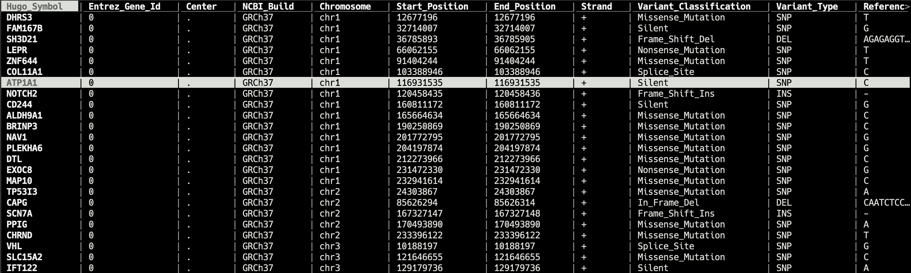

# bv
Data Viewer in Terminal for Bioinformatician


[](https://badge.fury.io/py/bv)
[](https://travis-ci.org/codechenx/bv)
[](https://github.com/codechenx/bv/blob/master/LICENSE)

[中文版说明](README_CN.md)
# Table of Contents

- [bv](#bv)
- [Table of Contents](#table-of-contents)
  ​    - [Description](#description)
- [Feature](#feature)
- [To do](#to-do)
- [Supported file types](#supported-file-types)
- [Installation](#installation)
    - [Linux and macOS](#linux-and-macos)
      - [pip](#pip)
      - [conda](#conda)
      - [Window](#window)
- [Key binding](#key-binding)
- [Usage](#usage)

#### Description

bv is a tool to view the common bioinformatics data file in terminal.The TUI of bv is modifyied from [vdtui](https://github.com/saulpw/visidata/blob/stable/visidata/vdtui.py)

 


# Feature

- Spreadsheet-like view for biological delimited data
- Vim-like key binding 
- Support for gzip compressed file
- Automatically identify unknown file type's delimiter


# To do

- support for bam and fastaq format


# Supported file types

| File type | filename extension | description                                                  |
| --------- | ------------------ | ------------------------------------------------------------ |
| csv       | .csv               | Delimited text file that uses a comma to separate values     |
| tsv       | .tsv               | Delimited text file that uses a tab to separate values       |
| excel     | .xlsx              | Microsoft Excel is a spreadsheet developed by Microsoft       |
| vcf       | .vcf               | The Variant Call Format (VCF) specifies the format of a text file used in bioinformatics for storing gene sequence variations |
| bed       | .bed               | A BED file  is a tab-delimited text file that defines a feature track |
| maf       | .maf               | Mutation Annotation Format (MAF) is a tab-delimited text file with aggregated mutation information from VCF Files and are generated on a project-level |
| gff       | .gff               | The GFF (General Feature Format) format consists of one line per feature, each containing 9 columns of data, plus optional track definition lines |
| gtf       | .gtf               | The Gene transfer format (GTF) is a file format used to hold information about gene structure |


# Installation
### Linux and macOS

#### pip
```bash
$ pip install bv
```

#### conda
```bash
$ conda install -c codechenx bv 
```


#### Window

Not Support


# Key binding
| Key               | description                                                 |
| ----------------- | ----------------------------------------------------------- |
| q                 | quit                                                        |
| h, left arrow     | go one column left                           |
| l, right arrow    | go one column right                          |
| j, down arrow     | go one row down                               |
| k, up             | go one row up                                |
| gg, gk         | go to top row                                |
| G, gj          | go to bottom row                          |
| gh | go to leftmost column |
| gl | go to rightmost column |
| ctrl-f, page down | scroll one page down                   |
| ctrl-b, page up | scroll one page up                       |
| < | move up to previous value in this column |
| > | move down to next value in this column |
| /                 | search this column forward for regex            |
| ？ | search this column backward for regex |
| g/ | search regex forward in all visible columns |
| g? | search regex backward in all visible columns |
| n                 | go to next match |
| p                 | go to previous match |
| s, space          | select this row                        |
| u                 | unselect this row             |
| gu | unselect all rows |
| { | move to previous selected row |
| } | move to next selected row |
| [ | sort by this column ascending |
| ] | sort by this column descending |
| - | hide this column |
| ctrl-l | redraw entire terminal screen |
| ctrl-g | show info for the current sheet |
| z?, F1 | open command help sheet |

# Usage

```console
usage: bv [-h] [-s S] [-ss SS] [-sn SN] [-rc RC [RC ...]] [-hc HC [HC ...]]
          [-type {csv,tsv,vcf,maf,gff,gtf,bed,xlsx}] [--noheader] [--trans]
          [--compressed]
          filename

positional arguments:
  filename              file name

optional arguments:
  -h, --help            show this help message and exit
  -s S                  delimiter
  -ss SS                ignore lines with specific prefix
  -sn SN                ignore first n lines
  -rc RC [RC ...]       only show columns(support for multiple arguments,
                        separated by space)
  -hc HC [HC ...]       hide columns(support for multiple arguments, separated
                        by space)
  -type {csv,tsv,vcf,maf,gff,gtf,bed}
                        specify a file type to file manual
  --noheader            not to use fist line as header
  --trans               view transposed data
  --compressed          file is compressed?
```