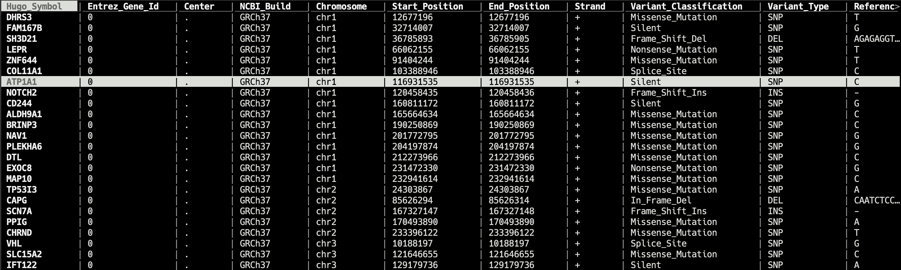

# bv
专为生物信息学设计的终端下的数据查看器


[](https://badge.fury.io/py/bv)
[](https://anaconda.org/codechenx/bv)
[](https://anaconda.org/codechenx/bv)
[](https://travis-ci.org/codechenx/bv)
[](https://github.com/codechenx/bv/blob/master/LICENSE)

[English](README.md)
# 目录

- [简介](#简介)
- [特点](#特点)
- [待完成](#待完成)
- [安装](#安装)
  - [Linux and macOS](#Linux-and-macOS)
- [键绑定](#键绑定)
- [用法](#用法)

#### 简介

bv 是一个在终端下查看常见生物信息学数据的查看器. bv的终端界面和键绑定代码修改自[vdtui](https://github.com/saulpw/visidata/blob/stable/visidata/vdtui.py)

 


# 特点

- 以表格的形式在终端下查看常见的生物学数据
- Vim类似的键绑定
- 支持gz格式的压缩文件
- 自动识别未知文件格式的分隔符

# 待完成

- 对于bam和fastaq格式的支持
- 查看URL指向的数据


# 支持的文件格式

| File type | filename extension | description                                                  |
| --------- | ------------------ | ------------------------------------------------------------ |
| csv       | .csv               | Delimited text file that uses a comma to separate values     |
| tsv       | .tsv               | Delimited text file that uses a tab to separate values       |
| excel     | .xlsx              | Microsoft Excel is a spreadsheet developed by Microsoft       |
| vcf       | .vcf               | The Variant Call Format (VCF) specifies the format of a text file used in bioinformatics for storing gene sequence variations |
| bed       | .bed               | A BED file  is a tab-delimited text file that defines a feature track |
| maf       | .maf               | Mutation Annotation Format (MAF) is a tab-delimited text file with aggregated mutation information from VCF Files and are generated on a project-level |
| gff       | .gff               | The GFF (General Feature Format) format consists of one line per feature, each containing 9 columns of data, plus optional track definition lines |
| gtf       | .gtf               | The Gene transfer format (GTF) is a file format used to hold information about gene structure |


# 安装


### Linux and macOS

#### pip
```bash
$ pip install bv
```

#### conda
```bash
$ conda install -c codechenx bv 
```


#### Window
不支持

# 键绑定
| Key               | description                                                 |
| ----------------- | ----------------------------------------------------------- |
| q                 | 退出                                                      |
| h, left arrow     | 向左移动一列        |
| l, right arrow    | 向右移动一列           |
| j, down arrow     | 向下移动一行               |
| k, up             | 向上移动一行                 |
| gg, gk         | 移动到顶部                           |
| G, gj          | 移动到底部                     |
| gh | 移动到最左列 |
| gl | 移动到最右列 |
| ctrl-f, page down | 移动到下一页             |
| ctrl-b, page up | 移动到上一页                 |
| < | 移动到跟当前具有相同数值的上一个位置 |
| > | 移动到跟当前具有相同数值的下一个位置 |
| /                 | 查找(仅所在列，向下) |
| ？ | 查找(仅所在列，向上) |
| g/ | 全局查找(向下) |
| g? | 全局查找(向上) |
| n                 | 移动到下一个查到的的位置上 |
| p                 | 移动到上一个查到的的位置上 |
| s, space          | 选中该行                   |
| u                 | 取消选中       |
| gu | 取消所有的选中 |
| { | 移动到上一个选中行 |
| } | 移动到下一个选中行 |
| [ | 递增排序 |
| ] | 递减排序 |
| - | 隐藏该列 |
| ctrl-l | 重新绘制屏幕 |
| ctrl-g | 显示信息 |
| z?, F1 | 显示快捷键帮助 |

# 用法

```console
usage: bv [-h] [-s S] [-ss SS] [-sn SN] [-rc RC [RC ...]] [-hc HC [HC ...]]
          [-type {csv,tsv,vcf,maf,gff,gtf,bed,xlsx}] [--noheader] [--trans]
          [--compressed]
          filename

positional arguments:

  filename              文件名

optional arguments:
  -h, --help            显示帮助信息
  -s S                  指定分隔符
  -ss SS                忽略带特殊前缀的行
  -sn SN                忽略前N行数据
  -rc RC [RC ...]       只展示指定的行(支持多个参数 ,参数间以空格分隔)
  -hc HC [HC ...]       隐藏指定的行(支持多个参数 ,参数间以空格分隔)
  -type {csv,tsv,vcf,maf,gff,gtf,bed,xlsx} 手动指定文件类型
  --noheader            不把第一行当做header行
  --trans               显示转置后的数据
  --compressed          文件是否是压缩的标志
```
